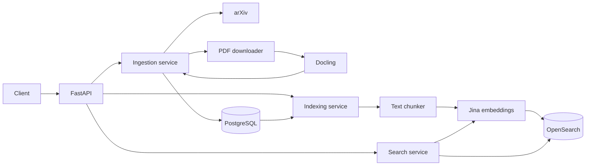

# Agentic Research Assistant

A research assistant for finding academic papers and answering questions using
retrieved sources.

The project currently supports arXiv ingestion, PDF processing, section-aware
chunking, and hybrid retrieval with BM25 and vector search.

## What works

- Fetch paper metadata from arXiv
- Skip papers that have already been stored
- Download and parse PDFs with Docling
- Store paper metadata and extracted content in PostgreSQL
- Index processed papers in OpenSearch
- Search papers with pagination, filters, highlighting, and optional typo tolerance
- Split papers into overlapping, section-aware chunks
- Generate passage and query embeddings with Jina AI
- Search chunks with vector similarity or BM25
- Combine keyword and semantic rankings with Reciprocal Rank Fusion
- Run the API and supporting services with Docker Compose

## Architecture



## Stack

- Python 3.12 and FastAPI
- PostgreSQL, SQLAlchemy, and Alembic
- Docling
- OpenSearch
- Jina AI embeddings
- Ollama
- Docker Compose
- pytest and Ruff

## Running the project

```bash
uv sync
docker compose up -d --build
uv run alembic upgrade head
```

API documentation is available at [http://localhost:8000/docs](http://localhost:8000/docs).

To ingest one recent AI paper:

```bash
curl -X POST \
  "http://localhost:8000/api/v1/papers/ingest?query=cat%3Acs.AI&max_results=1"
```

To index processed papers in OpenSearch:

```bash
curl -X POST "http://localhost:8000/api/v1/papers/index?limit=100"
```

To search indexed papers:

```bash
curl "http://localhost:8000/api/v1/papers/search?query=language%20models&size=10&offset=0"
```

To create and index searchable paper chunks:

```bash
curl -X POST "http://localhost:8000/api/v1/papers/index/chunks?limit=100"
```

To run hybrid chunk search:

```bash
curl "http://localhost:8000/api/v1/papers/search/hybrid?query=3D%20spatial%20reasoning&size=5"
```

Run the checks with:

```bash
uv run ruff check .
uv run pytest
```
